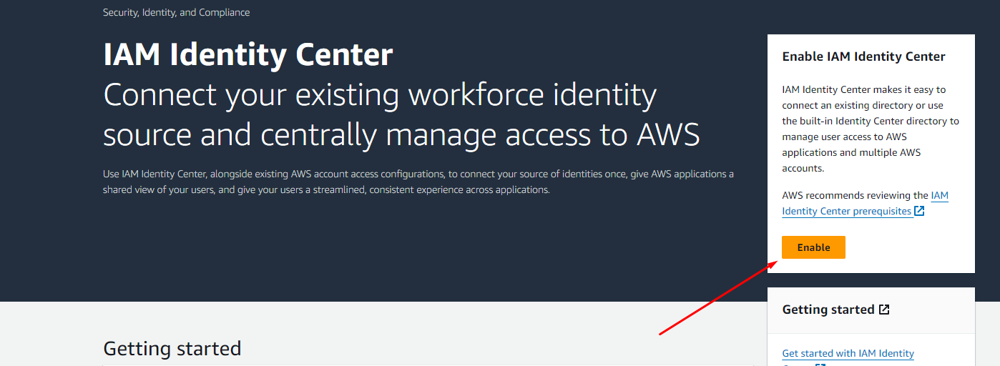

# AppSync && Amplify
## AppSync
- AppSync là một dịch vụ quản lý dữ liệu trên AWS, giúp tạo ra các API cho các ứng dụng di động và web, hỗ trợ nhiều loại nguồn dữ liệu như: DynamoDB, Aurora, Elasticsearch, Lambda, RDS, HTTP, ...
- AppSync hỗ trợ nhiều loại truy vấn như: Query, Mutation, Subscription.AppSync hỗ trợ nhiều loại định dạng dữ liệu như: JSON, GraphQL, ...AppSync hỗ trợ nhiều loại xác thực như: API Key, IAM, Cognito, OIDC, ...
- Lợi ích:
  - Thiết lập nhanh và mở rộng dễ dàng.
  - Real-time data and offline programming.
  - Bảo mật dữ liệu.
  - Tích hợp với nhiều loại nguồn dữ liệu.
## Amplify
- Amplify là một framework giúp xây dựng ứng dụng di động và web trên AWS một cách nhanh chóng và dễ dàng.
- Amplify hỗ trợ nhiều loại tính năng như: Auth, API, Storage, Analytics,Cache, UI ...
- Amplify hỗ trợ nhiều loại ngôn ngữ lập trình như: JavaScript, iOS, Android, Flutter, ...
- Amplify = FarameWork + Cloud Service + Dev Tools = CLI + Console + SDKs
### Configure Amplify CLI
- Install Dev Tools: Cmder, NodeJS, NPM, Git, VSCode, Amplify CLI
- Install Amplify CLI: 
  ```
  npm install -g @aws-amplify/cli
  ```
- Configure Amplify CLI:
  ```
  amplify configure
  ```
  - Trantienthuongtt97
  
  
  

### The AppSync API Console
  - Login vào AWS Console và chọn dịch vụ AppSync
  - Tạo một API mới
  - Query, Mutation, Subscription
  - DynamoDB, Lambda, ElasticSearch, RDS, HTTP, ...
  